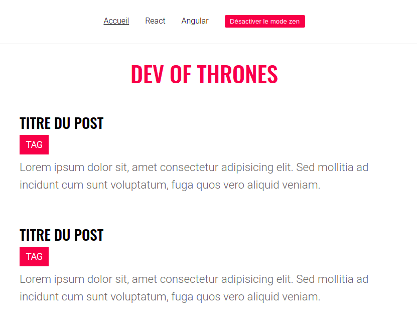

# Blog React

L'objectif va être de finaliser la construction d'un blog avec React :tada:

Commence par récupérer le React-modele et lance ton serveur de développement pour voir l'avancé du projet

## 1. Analyse

Le travail a été amorcé. Les composants sont créés et les styles en place.

Avant d'aller plus loin prend le temps d'analyser tout ça pour voir le rôle de chaque composant. D'ailleurs certains ne sont pas encore utilisés, ça viendra ;)

## 2. Props

Pour l'instant ce blog ne raconte pas grand chose d'intéressant.

Si tu regardes le composant racine, tu verras qu'il récupère des données correspondant aux catégories et aux articles de notre blog.

Tu dois diffuser ces données à travers ton application via les props.

Il faut utiliser les bonnes données pour avoir les bons intitulés des categories dans le menu en haut de la page et également compléter le contenu des articles.

## 3. State

Il est temps à présent d'ajouter une première fonctionnalité !

Tu vois ce gros bouton `Activer le mode zen` ?

Pour le moment il fait rien. Il faut qu'au clic, l'affichage change. On veut voir les articles en plus gros et sur une seule colonne. Si on reclique on repasse en affichage sur 2 colonnes et ainsi de suite.

Voilà ce que ça doit donner :

  
Mode zen : Off

  
Mode zen : On

